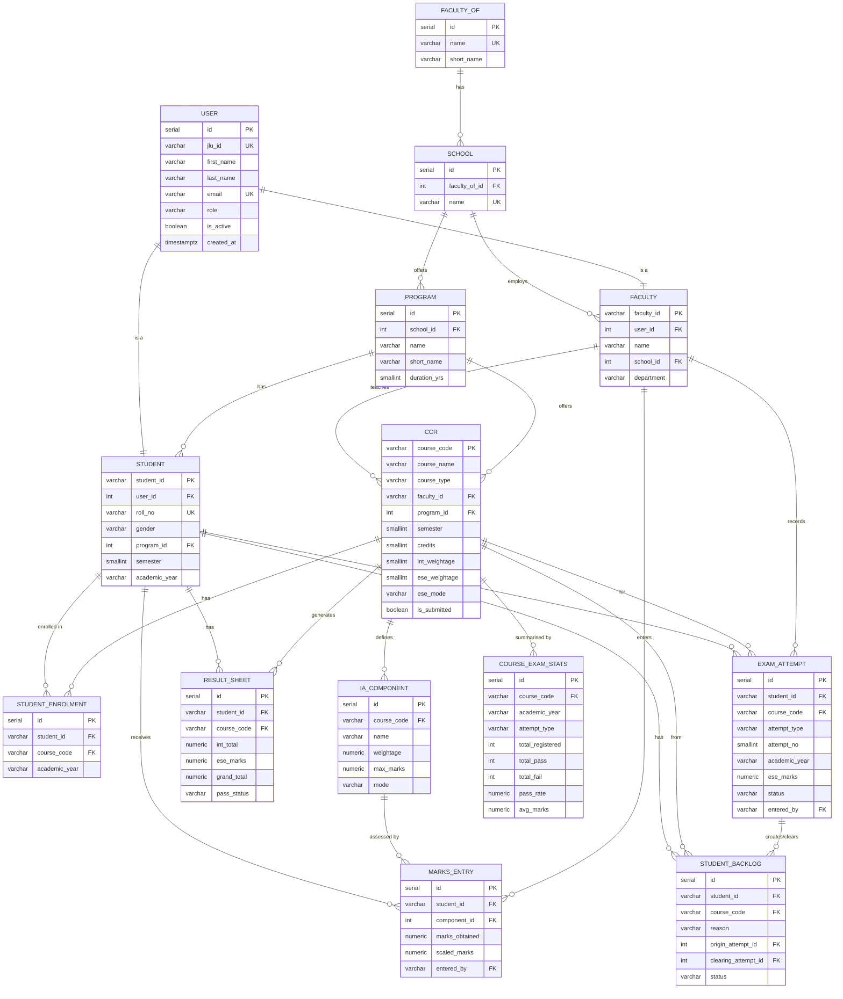

# JLU Marks Management System

A full-stack academic marks management portal for Jaypee Lakeview University (JLU), built with **Django REST Framework** on the backend and **React + Vite** on the frontend. It supports three user roles — Admin, Faculty, and Student — with role-aware dashboards, granular marks entry, automated result computation, and rich analytics.

---

## Table of Contents

1. [Features](#features)
2. [Architecture](#architecture)
3. [Tech Stack](#tech-stack)
4. [Project Structure](#project-structure)
5. [Getting Started](#getting-started)
   - [Prerequisites](#prerequisites)
   - [Backend Setup](#backend-setup)
   - [Frontend Setup](#frontend-setup)
   - [Docker (recommended)](#docker-recommended)
6. [Environment Variables](#environment-variables)
7. [Demo Credentials](#demo-credentials)
8. [API Reference](#api-reference)
9. [Analytics Endpoints](#analytics-endpoints)
10. [Data Model & Marks Flow](#data-model--marks-flow)
11. [Running Tests](#running-tests)
12. [Deployment Notes](#deployment-notes)
13. [Contributing](#contributing)

---

## Features

### Admin
- Full user management: create/manage Faculty and Student accounts
- Manage organisational hierarchy (Faculties-of, Schools, Programs)
- Create and configure courses (Course-Credit-Register)
- Define Internal Assessment (IA) components with weightages
- Enrol students into courses; bulk enrolment support
- Unlock/lock courses for marks entry
- Export result sheets to PDF and Excel
- System-wide analytics dashboard

### Faculty
- View assigned courses and enrolled students
- Define IA components for their courses
- Enter marks individually or in bulk (`bulk_enter`)
- Enter End-Semester Exam (ESE) marks
- Trigger result computation (`compute` / `compute_all`)
- Export per-course result sheets
- Course-level analytics and grade distribution

### Student
- View own results across all courses
- Detailed IA breakdown per course
- Grade history and backlog tracking
- Export personal result sheet

---

## Architecture

```
┌──────────────────────────────────────────────────────────────┐
│                     React + Vite Frontend                    │
│  (Login → Dashboard → Courses → Marks Entry → Analytics)    │
│                   http://localhost:5173                       │
└──────────────────────┬───────────────────────────────────────┘
                       │  REST API (JWT Bearer)
┌──────────────────────▼───────────────────────────────────────┐
│                Django REST Framework Backend                  │
│         Signals · Permissions · Custom JWT Claims            │
│                   http://localhost:8000                       │
└──────────────────────┬───────────────────────────────────────┘
                       │  psycopg2
┌──────────────────────▼───────────────────────────────────────┐
│                   PostgreSQL 16                               │
└──────────────────────────────────────────────────────────────┘
```

---

## Tech Stack

| Layer | Technology |
|---|---|
| Frontend framework | React 18 + Vite |
| Frontend routing | React Router DOM v6 |
| HTTP client | Axios |
| Charts | Recharts |
| PDF export | jsPDF + jsPDF-AutoTable |
| Excel export | SheetJS (xlsx) |
| Backend framework | Django 4.2 |
| REST API | Django REST Framework 3.14 |
| Authentication | JWT via `djangorestframework-simplejwt` |
| Database | PostgreSQL 16 (psycopg2) |
| Filtering | django-filter |
| Config management | python-decouple |
| Containerisation | Docker + Docker Compose |

---

## Database & Schema

> The schema is defined entirely in [`jlu_marks/core/models.py`](jlu_marks/core/models.py) and applied automatically by Django migrations — there is no hand-written SQL to run manually.
>
> - **Full SQL DDL** → [`docs/schema.sql`](docs/schema.sql)
> - **Full ER diagram** → [`docs/er_diagram.md`](docs/er_diagram.md)

### Entity Relationship Diagram



---

## Project Structure

```
draft-3/
├── jlu_frontend/                  # React + Vite frontend
│   ├── src/
│   │   ├── pages/
│   │   │   ├── Login.jsx          # Auth page
│   │   │   ├── Dashboard.jsx      # Role-aware home
│   │   │   ├── Courses.jsx        # Course listing
│   │   │   ├── CourseDetail.jsx   # Marks entry & IA management
│   │   │   ├── AdminPanel.jsx     # Admin-only management UI
│   │   │   ├── Analytics.jsx      # Charts & statistics
│   │   │   ├── Students.jsx       # Student listing (admin/faculty)
│   │   │   ├── StudentReport.jsx  # Individual student report
│   │   │   ├── Backlogs.jsx       # Backlog tracker
│   │   │   ├── ExamAttempts.jsx   # Exam attempt records
│   │   │   ├── Profile.jsx        # User profile
│   │   │   └── NotFound.jsx       # 404 page
│   │   ├── components/
│   │   │   ├── Layout.jsx         # App shell with sidebar
│   │   │   ├── Modal.jsx          # Reusable modal
│   │   │   ├── ExportButton.jsx   # PDF / Excel export
│   │   │   ├── ProtectedRoute.jsx # Auth guard
│   │   │   └── Skeleton.jsx       # Loading skeletons
│   │   ├── context/               # React context (auth state)
│   │   ├── api.js                 # Axios instance + all API calls
│   │   ├── App.jsx                # Router & route definitions
│   │   ├── main.jsx               # Entry point
│   │   └── index.css              # Global styles
│   ├── index.html
│   ├── vite.config.js
│   └── package.json
│
└── jlu_marks/                     # Django backend
    ├── core/                      # Main Django application
    │   ├── models.py              # 11 models, 5 enums
    │   ├── serializers.py         # DRF serializers + combined create flows
    │   ├── views.py               # ViewSets + custom actions
    │   ├── analytics.py           # 6 analytics/reporting endpoints
    │   ├── filters.py             # FilterSet classes (range, cross-table)
    │   ├── permissions.py         # Role-based permission classes
    │   ├── signals.py             # Auto ResultSheet creation + int_total recompute
    │   ├── token.py               # Custom JWT with role/profile_id claims
    │   ├── exceptions.py          # Uniform error envelope + domain exceptions
    │   ├── admin.py               # Full Django admin (search, filter, inlines)
    │   ├── apps.py                # CoreConfig (wires signals)
    │   ├── tests.py               # 45+ tests across models, signals, API, analytics
    │   ├── urls.py                # DRF router
    │   └── management/commands/
    │       └── seed_demo.py       # One-command demo data seeder
    ├── jlu_marks/                 # Django project config
    │   ├── settings.py
    │   ├── urls.py
    │   └── wsgi.py
    ├── manage.py
    ├── requirements.txt
    ├── Dockerfile
    ├── docker-compose.yml
    └── .env.example
```

---

## Getting Started

### Prerequisites

- Python 3.11+
- Node.js 20+ and npm
- PostgreSQL 14+ **or** Docker Desktop

---

### Backend Setup

```bash
# 1. Navigate to the backend directory
cd jlu_marks

# 2. Create and activate a virtual environment
python -m venv .venv
source .venv/bin/activate        # Windows: .venv\Scripts\activate

# 3. Install Python dependencies
pip install -r requirements.txt

# 4. Create the PostgreSQL database
psql -U postgres -c "CREATE DATABASE jlu_marks_db;"

# 5. Configure environment
cp .env.example .env
# Open .env and set SECRET_KEY, DB_PASSWORD, etc.

# 6. Run database migrations
python manage.py migrate

# 7. (Optional) Seed demo data
python manage.py seed_demo

# 8. Start the development server
python manage.py runserver
```

API base URL: `http://localhost:8000/api/`
Django admin: `http://localhost:8000/admin/`

---

### Frontend Setup

```bash
# 1. Navigate to the frontend directory
cd jlu_frontend

# 2. Install Node dependencies
npm install

# 3. Start the Vite dev server
npm run dev
```

Frontend URL: `http://localhost:5173`

> The frontend proxies API calls to `http://localhost:8000` via `vite.config.js`.

---

### Docker (recommended)

The easiest way to run both services locally:

```bash
cd jlu_marks

# 1. Copy and configure the env file
cp .env.example .env         # Edit SECRET_KEY if desired

# 2. Build and start DB + Django
docker compose up --build

# 3. Seed demo data (in a separate terminal)
docker compose exec web python manage.py seed_demo
```

| Service | URL |
|---|---|
| Django API | http://localhost:8000/api/ |
| Django Admin | http://localhost:8000/admin/ |
| pgAdmin (optional) | `docker compose --profile debug up` → http://localhost:5050 |

---

## Environment Variables

Copy `jlu_marks/.env.example` to `jlu_marks/.env` and fill in the values:

| Variable | Default | Description |
|---|---|---|
| `SECRET_KEY` | *(required)* | Django secret key |
| `DEBUG` | `True` | Set to `False` in production |
| `ALLOWED_HOSTS` | `localhost,127.0.0.1` | Comma-separated allowed hosts |
| `DB_NAME` | `jlu_marks_db` | PostgreSQL database name |
| `DB_USER` | `postgres` | PostgreSQL username |
| `DB_PASSWORD` | *(required)* | PostgreSQL password |
| `DB_HOST` | `localhost` | Database host |
| `DB_PORT` | `5432` | Database port |
| `CORS_ALLOWED_ORIGINS` | `http://localhost:3000` | Frontend origin(s) |
| `ACCESS_TOKEN_LIFETIME_MINUTES` | `60` | JWT access token TTL |
| `REFRESH_TOKEN_LIFETIME_DAYS` | `7` | JWT refresh token TTL |

---

## Demo Credentials

After running `python manage.py seed_demo`:

| Role | JLU ID | Password |
|---|---|---|
| Admin | `ADM001` | `Admin@1234` |
| Faculty | `FAC001` | `Faculty@1234` |
| Student | `STU001` | `Student@1234` |
| Student | `STU002` | `Student@1234` |

The seeder also creates course **CS301** with IA components, enrolments, and sample marks.

---

## API Reference

All endpoints require `Authorization: Bearer <access_token>` except `/api/auth/login/`.

### Authentication

| Endpoint | Method | Description |
|---|---|---|
| `/api/auth/login/` | POST | Obtain access + refresh token pair |
| `/api/auth/refresh/` | POST | Refresh access token |
| `/api/users/me/` | GET | Current user profile |
| `/api/users/change_password/` | POST | Change password |

**Login request:**
```json
{ "jlu_id": "FAC001", "password": "Faculty@1234" }
```

**Login response:**
```json
{
  "access":     "<jwt>",
  "refresh":    "<jwt>",
  "role":       "faculty",
  "full_name":  "Ramesh Sharma",
  "jlu_id":     "FAC001",
  "profile_id": "F001"
}
```

### Core Resources

| Endpoint | Admin | Faculty | Student |
|---|---|---|---|
| `GET/POST /api/faculty-of/` | ✓ / ✓ | ✓ / — | ✓ / — |
| `GET/POST /api/schools/` | ✓ / ✓ | ✓ / — | ✓ / — |
| `GET/POST /api/programs/` | ✓ / ✓ | ✓ / — | ✓ / — |
| `GET/POST /api/faculty/` | ✓ / ✓ | ✓ / — | ✓ / — |
| `GET/POST /api/students/` | ✓ / ✓ | ✓ / — | ✓ / — |
| `GET/POST /api/ccr/` | ✓ / ✓ | ✓ / — | ✓ / — |
| `GET/POST /api/enrolments/` | ✓ / ✓ | ✓ / ✓ | ✓ / — |
| `GET/POST /api/ia-components/` | ✓ / ✓ | ✓ / ✓ | ✓ / — |
| `GET/POST /api/marks/` | ✓ / ✓ | ✓ / ✓ | ✓ / — |
| `POST /api/marks/bulk_enter/` | ✓ | ✓ | — |
| `GET /api/result-sheets/` | ✓ | ✓ | ✓ |
| `POST /api/result-sheets/{id}/enter_ese/` | ✓ | ✓ | — |
| `POST /api/result-sheets/{id}/compute/` | ✓ | ✓ | — |
| `POST /api/result-sheets/compute_all/` | ✓ | ✓ | — |

### Useful Nested Actions

```
GET /api/students/{id}/results/        → student's result sheets
GET /api/students/{id}/marks/          → all marks entries for a student
GET /api/ccr/{id}/enrolled_students/   → enrolment list for a course
GET /api/ccr/{id}/ia_components/       → IA components for a course
```

### Bulk Marks Entry

```json
POST /api/marks/bulk_enter/
[
  { "student": "S001", "component": 1, "marks_obtained": 38 },
  { "student": "S002", "component": 1, "marks_obtained": 42 }
]
```
Returns HTTP 207 with `{ "saved": [...], "errors": [...] }`.

### Error Response Envelope

All API errors return a consistent shape:
```json
{
  "success": false,
  "code":    "validation_error",
  "message": "marks_obtained (99) exceeds max_marks (50).",
  "errors":  { "marks_obtained": "marks_obtained (99) exceeds max_marks (50)." }
}
```

---

## Analytics Endpoints

All analytics endpoints require authentication.

| Endpoint | Roles | Description |
|---|---|---|
| `GET /api/analytics/dashboard/` | All | Role-aware: admin sees system stats, faculty sees their courses, student sees their results |
| `GET /api/analytics/course_summary/?course=CS301` | Admin, Faculty | Enrolment count, completion %, pass/fail counts, avg/max/min |
| `GET /api/analytics/grade_distribution/?course=CS301` | All | Grade band breakdown with counts and percentages |
| `GET /api/analytics/toppers/?course=CS301&limit=10` | All | Top-N students ranked by grand total |
| `GET /api/analytics/student_report/?student=S001` | All (students: own only) | Full report — all courses, IA breakdown, grades |
| `GET /api/analytics/ia_breakdown/?course=CS301` | Admin, Faculty | Per-component avg/max/min, completion %, missing count |

**Grade Bands:**

| Grade | Range |
|---|---|
| O | 90–100 |
| A+ | 80–89.99 |
| A | 70–79.99 |
| B+ | 60–69.99 |
| B | 50–59.99 |
| C | 40–49.99 |
| F | 0–39.99 |

---

## Data Model & Marks Flow

The system has **11 core models** across a clear hierarchy:

```
FacultyOf → School → Program
                        ↓
                 CourseCreditRegister (CCR)
                        ↓
              Enrolment (Student ↔ CCR)
                        ↓
            IAComponent  ←  MarksEntry
                        ↓
                  ResultSheet
```

**Marks computation:**

```
MarksEntry.marks_obtained
    → scaled_marks = (marks_obtained / max_marks) × weightage   [auto on save]

ResultSheet.compute()
    → int_total   = Σ scaled_marks  (for that student + course)
    → grand_total = int_total × (int_weightage / 100)
                  + ese_marks  × (ese_weightage / 100)
```

Django **signals** automatically:
- Create a `ResultSheet` when a student is enrolled
- Recompute `int_total` whenever a `MarksEntry` is saved or deleted

---

## Running Tests

```bash
# Local (activate venv first)
python manage.py test core --verbosity=2

# In Docker
docker compose exec web python manage.py test core --verbosity=2
```

The test suite (45+ tests) covers:

- Model validation — weightage sums, semester range, `total_hrs` auto-compute
- Scaled marks — automatic calculation on `MarksEntry.save()`
- Signals — `ResultSheet` auto-creation on enrolment, `int_total` recomputation on marks save/delete
- Grand total — full marks flow: IA entry → ESE entry → compute
- Permissions — admin-only create, faculty marks entry, student read-only
- API endpoints — login, me, CRUD, bulk entry, filters
- Analytics endpoints — dashboard, course summary, grade distribution, toppers, student report, IA breakdown
- Duplicate guards — duplicate enrolment, marks exceeding `max_marks`

---

## Deployment Notes

- Set `DEBUG=False` and a strong `SECRET_KEY` in production
- Use a proper WSGI server (e.g., **gunicorn**) behind **nginx**
- Build the frontend for production: `cd jlu_frontend && npm run build` — serve `dist/` as static files
- Add your domain to `ALLOWED_HOSTS` and `CORS_ALLOWED_ORIGINS`
- Run migrations before starting: `python manage.py migrate`

---

## Contributing

1. Fork the repository
2. Create a feature branch: `git checkout -b feature/your-feature`
3. Commit your changes: `git commit -m "feat: describe your change"`
4. Push to the branch: `git push origin feature/your-feature`
5. Open a Pull Request

---

*Built by [Prithvi Raj Arora](https://github.com/PrithviRajArora) — Semester 6, Project 2*
