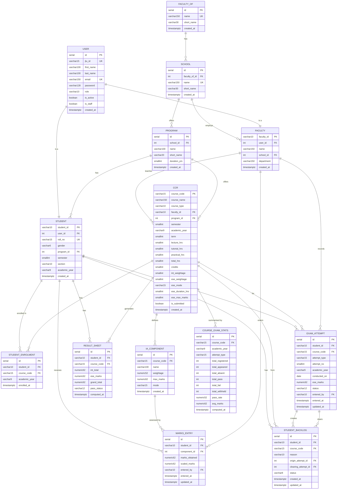

# JLU Marks Management System — Entity Relationship Diagram

> Rendered automatically by GitHub. All 14 tables shown with columns, types, and relationships.

---

## Table Summary

| Table | Rows (purpose) |
|---|---|
| `users` | Central auth — all roles share one table |
| `faculty_of` | Top-level organisational unit (e.g. Faculty of Engineering) |
| `school` | School within a Faculty-Of |
| `program` | Degree programme within a School |
| `faculty` | Faculty member profile linked to a User |
| `student` | Student profile linked to a User |
| `ccr` | Course Credit Register — one row per course offering |
| `student_enrolment` | Many-to-many between Student and CCR |
| `ia_component` | Internal Assessment component defined per course |
| `marks_entry` | Per-student, per-component marks (scaled automatically) |
| `result_sheet` | Aggregated result per student per course |
| `exam_attempt` | Every ESE sitting (Regular / Makeup / Backlog) |
| `student_backlog` | Active/cleared exam debts |
| `course_exam_stats` | Denormalised pass-rate stats, refreshed on demand |

## Key Business Rules

- `int_weightage + ese_weightage = 100` (enforced in `CCR.clean()`)
- `scaled_marks = (marks_obtained / max_marks) × weightage` (auto on `MarksEntry.save()`)
- `grand_total = int_total × (int_weightage/100) + ese_marks × (ese_weightage/100)` (on `ResultSheet.compute()`)
- A `ResultSheet` is created automatically when a student is enrolled (Django signal)
- `int_total` is recomputed automatically whenever a `MarksEntry` is saved or deleted (Django signal)
- `attempt_no` is auto-incremented within `(student, course)` on `ExamAttempt.save()`
